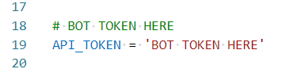

# TelegramPythonBot
Bot for Telegram

## Краткое описание
Бот помогает вести учет личных финансовых расходов и поступлений

## Запуск
- Получить токен для бота при помощи [BotFather](https://t.me/BotFather)
- Вставить токен в соответствующем месте в коде:
  
- Запустить main.py
- При запуске, бот создает базу данных в директории проекта, при взаимодействии пользователя с ботом, в эту базу вносится информация

## Работа с ботом
- Пользователь 
- Пользователь может добавить категорию расходов или источник дохода. Существует категория расходов и источник дохода по умолчанию - они называются "General"
- Пользователь может внести новую запись о доходах или расходах
- Пользователь может посмотреть историю своих операций